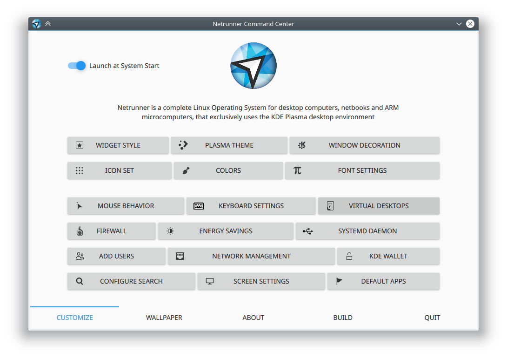

# Netrunner Command Center
First run settings and info app for Netrunner, written in QML



### License
GPL

### Dependencies

qt5-quickcontrols2, qt5-webview, plasma-framework


### Installation
Go to the source directory of the project and run:

```
/usr/lib/qt5/bin/qmake netrunner-command-center.pro
make
make install
```

Make sure to adjust to the correct path of your Qt5 qmake. This will build and install Netrunner Command Center, including localizations files.
